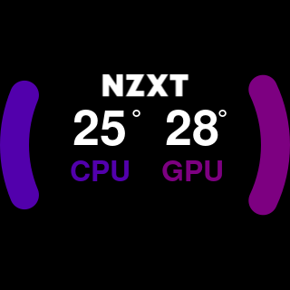

# nz3xt 

## Python script for creating gauges and patterns suitable for nzxt z3 pumheads

    Usage:
      nz3xt single     <primary_color> <secondary_color> <text_color> <name> <value> <unit> <filename>
      nz3xt double     <primary_color> <secondary_color> <primary_name> <primary_value> <primary_unit> <secondary_name> <secondary_value>  <secondary_unit> <filename>
      nz3xt taichi     <primary_color> <secondary_color> <rotation> <filename>
      nz3xt sweep      <primary_color> <rotation> <filename>
      nz3xt rainbow    <rotation> <filename>
      nz3xt spectrum   <progress> <filename>
      nz3xt colorwheel <primary_color> <secondary_color> <quaternary_color> <quinary_color> <rotation> <filename>

## `Examples`

   
   
   
   
   
   
   
   
   

